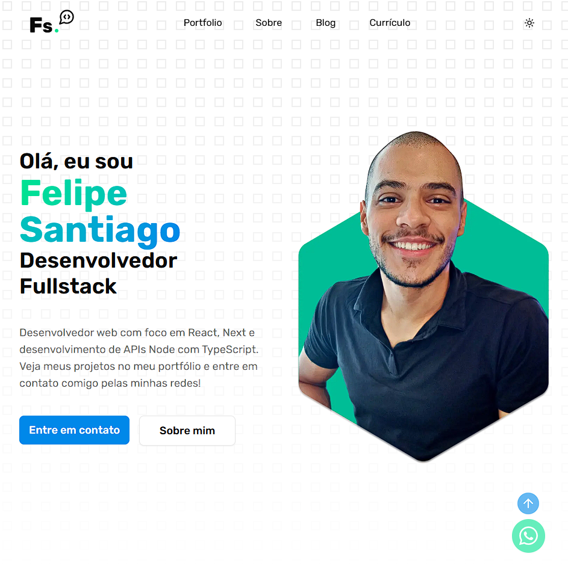

# Portfólio Felipe Santiago

## Sumário

- [Dependências](#dependências)
- [Dependências de Desenvolvimento](#depêndencias-de-desenvolvimento)
- [Objetivos](#objetivos)
- [Sobre o Projeto](#sobre-o-projeto)
- [Como Executar o Projeto](#como-executar-o-projeto)
- [Informações do Autor](#informações-do-autor)

## Dependências

- [Next.js](https://nextjs.org/): Framework React completo para aplicações web rápidas, com renderização do lado do servidor e geração de páginas estáticas.

- [React](https://react.dev/): Biblioteca JavaScript para construção de interfaces de usuário.

- [Tailwind CSS](https://tailwindcss.com/): Framework utilitário para estilização rápida e responsiva usando classes CSS.

- [Radix UI](https://www.radix-ui.com/): Conjunto de componentes acessíveis e prontos para uso em React.

- [Framer Motion](https://www.framer.com/motion/): Biblioteca de animações para React, com API simples e poderosa.

- [React Hook Form](https://react-hook-form.com/): Gerenciador de formulários eficiente e fácil de usar em React.

- [Zod](https://zod.dev/): Biblioteca de validação e tipagem de esquemas em TypeScript.

- [Font Awesome](https://fontawesome.com/): Biblioteca de ícones populares para aplicações web.

## Depêndencias de Desenvolvimento

- [TypeScript](https://www.typescriptlang.org/): Linguagem que adiciona tipagem estática ao JavaScript, melhorando a escalabilidade do código.

- [ESLint](https://eslint.org/): Ferramenta de análise de código para identificar problemas e padronizar boas práticas em JavaScript/TypeScript.

- [Prettier](https://prettier.io/): Formatador de código automático que garante consistência no estilo de escrita.

- [Tailwind CSS](https://tailwindcss.com/): Framework de utilitários para estilização, também utilizado em tempo de desenvolvimento com plugins e integração com Prettier.

- [prettier-plugin-tailwindcss](https://github.com/tailwindlabs/prettier-plugin-tailwindcss): Plugin do Prettier que organiza automaticamente as classes do Tailwind CSS.

- [eslint-plugin-simple-import-sort](https://github.com/lydell/eslint-plugin-simple-import-sort): Plugin do ESLint que ordena automaticamente os imports de forma inteligente.

## Objetivos

- [x] Integrar com a API do Hygraph utilizando GraphQL para gerenciamento de dados
- [x] Exibir os projetos do portfólio dinamicamente a partir do Hygraph
- [x] Permitir filtro dos projetos por tecnologia utilizada
- [x] Exibir publicações do blog consumidas via Hygraph
- [x] Permitir filtro das publicações por título e categoria
- [x] Estruturar o site em seções bem definidas: Portfólio, Sobre, Blog e Currículo

## Sobre o Projeto

Este projeto foi desenvolvido com foco em performance, organização e escalabilidade. Abaixo, alguns pontos-chave da sua estrutura:

- **Integração com o [Hygraph](https://hygraph.com/)**: Todo o projeto foi associado ao Hygraph para manipulação de dados, onde é possível organizar os dados do projeto remotamente, fora do código.

- **Next.js com Fetch Nativo**: Através do Next, usando o Fetch nativo, foi possível simplificar a metodologia de busca, quando comparado ao React que utiliza do Apollo Client.

- **Estilização com [Tailwind CSS](https://tailwindcss.com/)**: Todo o layout e estilo visual foram construídos com Tailwind CSS, garantindo responsividade, agilidade no desenvolvimento e fácil manutenção.

- **Animações com [Framer Motion](https://www.framer.com/motion/)**: Foi utilizada para adicionar interações visuais, como efeitos de _hover_ em botões do cabeçalho e rodapé, além da animação de carregamento na entrada da página inicial (componente Hero).

- **Componentes com [Radix UI](https://www.radix-ui.com/)**: Foram utilizados componentes acessíveis e estilizados, adaptados ao projeto para garantir consistência visual e melhor experiência do usuário.

## Como executar o projeto

1. Baixar as dependências com `npm install`;

2. Configurar as variáveis ambiente. Verifique o arquivo `env.example` para verificar quais variáveis precisam ser configuradas. Verifique o arquivo `src/env/index.ts` para verificar quais variáveis são obrigatórias e qual é o formato esperado (string/number/boolean, etc);

3. Rodar o projeto com `npm run dev`;

## Informações do Autor

- GitHub - [Felipe Santiago Morais](https://github.com/SantiagoMorais)
- Linkedin - [Felipe Santiago](https://www.linkedin.com/in/felipe-santiago-873025288/)
- Instagram - [@felipe.santiago.morais](https://www.instagram.com/felipe.santiago.morais)
- Email - <a href="mailto:contatofelipesantiago@gmail.com" target="blank">contatofelipesantiago@gmail.com</a>
- <a href="https://api.whatsapp.com/send?phone=5531996951033&text=Hi%2C%20Felipe%21%20I%20got%20your%20contact%20from%20your%20github.">Whatsapp</a>
